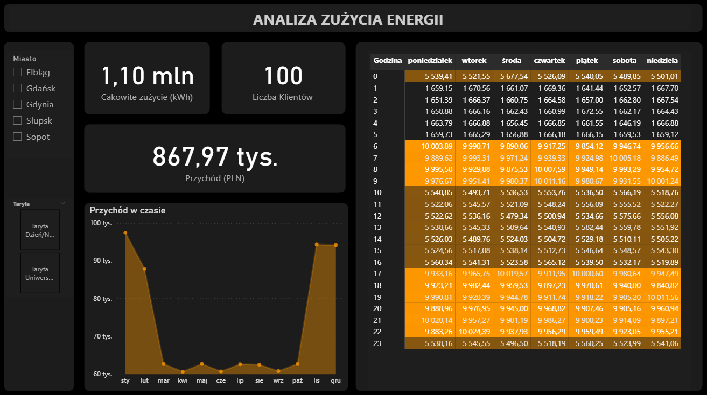

# ⚡ Analiza Zużycia Energii i Rentowności Taryf (Energa Case Study)

> **Business Intelligence Dashboard** symulujący analizę danych dla Operatora Systemu Dystrybucyjnego (OSD). Projekt skupia się na identyfikacji wzorców zużycia (Peak Load) oraz optymalizacji przychodów w zależności od taryf energetycznych (G11 vs G12).

## 🎯 Cel Projektu
Celem było stworzenie narzędzia analitycznego pozwalającego na:
1.  **Analizę obciążenia sieci** w ujęciu godzinowym (Heatmapa szczytów energetycznych).
2.  **Porównanie rentowności taryf** (G11 - stała vs G12 - zmienna) w oparciu o rzeczywiste profile zużycia klientów.
3.  **Symulację środowiska "Big Data"** – praca na dużym wolumenie danych transakcyjnych (odczyty liczników).

## 🛠 Technologie i Narzędzia
Projekt łączy kompetencje **Data Engineeringu** (Python) oraz **Business Intelligence** (Power BI).

| Kategoria | Technologie |
| :--- | :--- |
| **ETL & Data Gen** | 🐍 **Python** (Pandas, NumPy) |
| **BI & Wizualizacja** | 📊 **Power BI** |
| **Analityka** | 🧮 **DAX** (Data Analysis Expressions) |
| **Modelowanie** | ❄️ **Star Schema / Snowflake** |

## 🚀 Kluczowe Funkcjonalności

### 1. Generator Danych (Python)
Zamiast korzystać z gotowych, "czystych" datasetów, napisałem własny skrypt w Pythonie symulujący realia rynku energii:
* Generowanie **~800,000 wierszy** odczytów godzinowych.
* Implementacja **profili zużycia**: szczyty poranne/wieczorne, obniżone zużycie nocne, sezonowość (zima/lato).
* Symulacja różnych typów liczników i grup taryfowych.

### 2. Zaawansowany Model Danych (Power BI)
Zastosowano architekturę **Snowflake Schema** zoptymalizowaną pod wydajność:
* `FactOdczyty`: Tabela faktów z odczytami liczników.
* `DimKlient`, `DimTaryfa`: Wymiary opisujące odbiorców i cenniki.
* `DimData`: Tabela dat ze wsparciem dla sortowania niestandardowego (Dni tygodnia, Miesiące).

### 3. Analityka DAX
Zaimplementowano miary kontekstowe, m.in.:
* **Dynamiczny Przychód:** Obliczany "w locie" przy użyciu funkcji iteracyjnych (`SUMX`), uwzględniający stawkę taryfową zależną od godziny (Szczyt/Poza szczytem).
* **Time Intelligence:** Analiza trendów w czasie.

### 4. UI/UX "Dark Mode"
Dashboard zaprojektowany w stylu **Modern Dark UI**, typowym dla centrów sterowania siecią:
* Wysoki kontrast dla kluczowych wskaźników (KPI).
* **Heatmapa Obciążenia:** Wizualizacja godzin szczytu (Peak Hours) pozwalająca błyskawicznie zidentyfikować anomalie.

## 💡 Wnioski Biznesowe (Business Insights)
Analiza danych pozwoliła zidentyfikować kluczowe obszary do optymalizacji:

1.  **Zarządzanie Popytem (Demand Response):**
    * Heatmapa wskazuje krytyczne obciążenie sieci w godz. **17:00-22:00** (tzw. wieczorny szczyt energetyczny).
    * *Rekomendacja:* Promocja taryf strefowych (G12/G12w) w celu spłaszczenia krzywej popytu ("Peak Shaving") i przesunięcia konsumpcji na godziny nocne.

2.  **Sezonowość Przychdów:**
    * Analiza trendu rocznego wykazuje **30% spadek obciążenia** w miesiącach wiosennych i letnich (kwiecień-wrzesień).
    * *Rekomendacja:* Wykorzystanie tego okna czasowego na planowane prace modernizacyjne infrastruktury OSD (Maintenance Windows).

3.  **Segmentacja Klientów:**
    * Zidentyfikowano grupę klientów na taryfie stałej (G11) o wysokim zużyciu nocnym.
    * *Rekomendacja:* Kampania upsellingowa taryf dynamicznych – zwiększenie satysfakcji klienta poprzez obniżenie ich rachunków przy zachowaniu stabilności sieci.

## 📂 Struktura Repozytorium
* `/Data` - Wygenerowane pliki CSV (Surowe dane).
* `/Scripts` - Kod źródłowy Python do generowania danych.
* `/Reports` - Pliki wynikowe:
    * `Energa_Dashboard.pbix` (Projekt Power BI)
    * `Energa_Raport.pdf` (Podgląd PDF)